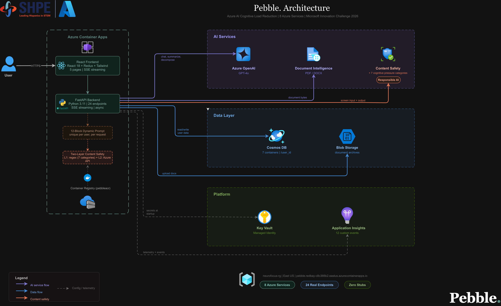
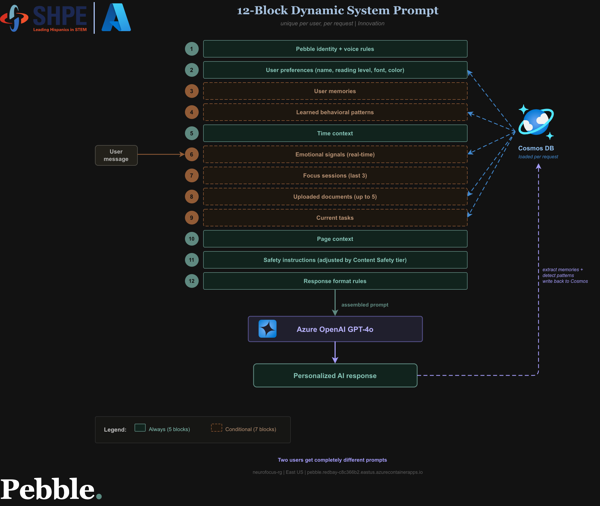
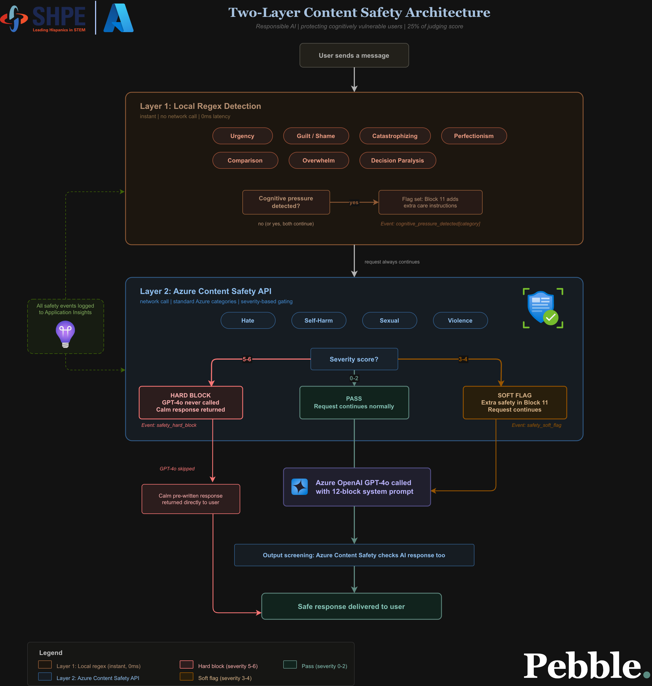
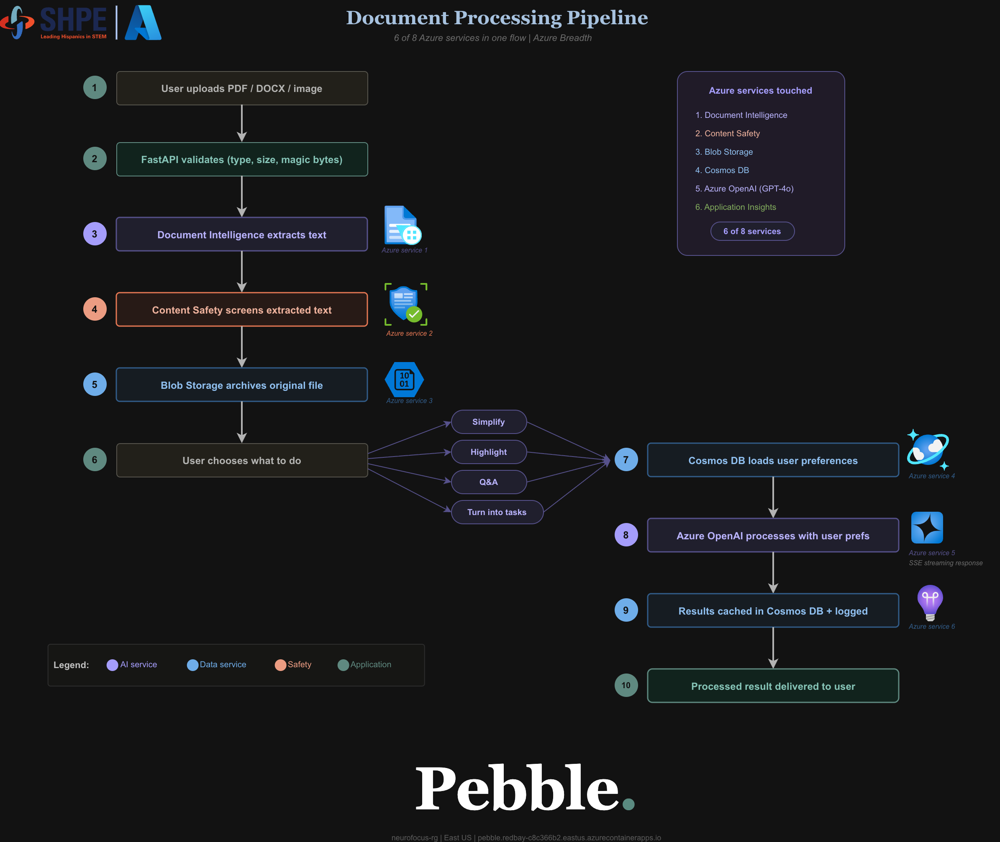
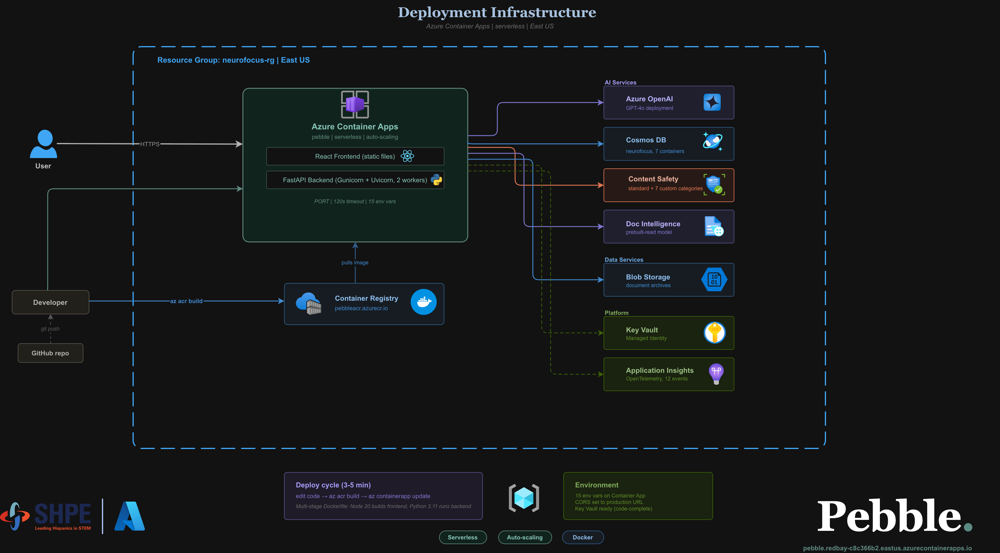

<div align="center">


### *a calm place to start*

**An AI cognitive support companion that transforms overwhelming information into calm, structured, personalized clarity.**
**Built from the ground up for neurodiverse users — every color, every word, every animation was a deliberate choice.**

<br/>

### 👉 [**Try Pebble right now — no login required**](https://pebble.redbay-c8c366b2.eastus.azurecontainerapps.io)

*Deployed live on Azure Container Apps. Open it. Talk to it. It's ready.*

<br/>

[](https://python.org)
[](https://fastapi.tiangolo.com)
[](https://react.dev)
[](https://azure.microsoft.com)
[](LICENSE)
[](https://pebble.redbay-c8c366b2.eastus.azurecontainerapps.io)
[](https://drive.google.com/file/d/17prNYPP_y0JbiZbdeOno3abUTiG4su6R/view?usp=sharing)

---

### [🌐 Try the App](https://pebble.redbay-c8c366b2.eastus.azurecontainerapps.io) &nbsp;·&nbsp; [🎥 Video Walkthrough](https://drive.google.com/file/d/17prNYPP_y0JbiZbdeOno3abUTiG4su6R/view?usp=sharing) &nbsp;·&nbsp; [📊 Slide Deck](presentation/pebble_presentation.pptx) &nbsp;·&nbsp; [📄 Project Report](docs/reports/pebble_project_report.docx)

---

*Microsoft Innovation Challenge — SHPE 2026 &nbsp;|&nbsp; Challenge: **Cognitive Load Reduction** &nbsp;|&nbsp; March 16–27, 2026*

</div>

---

## Table of Contents

1. [The Problem](#the-problem)
2. [Who Pebble Is For](#who-pebble-is-for)
3. [App Screenshots](#app-screenshots)
4. [What Pebble Does](#what-pebble-does)
5. [Architecture Diagrams](#architecture-diagrams)
6. [Responsible AI](#responsible-ai)
7. [How the AI Works — The 12-Block Prompt](#how-the-ai-works--the-12-block-prompt)
8. [Azure Services — 8 Integrated](#azure-services--8-integrated)
9. [Tech Stack](#tech-stack)
10. [Project Structure](#project-structure)
11. [Getting Started](#getting-started)
12. [Environment Variables](#environment-variables)
13. [API Reference](#api-reference)
14. [Judging Criteria Alignment](#judging-criteria-alignment)
15. [Documentation](#documentation)
16. [Team](#team)
17. [License](#license)

---

## The Problem

**1 in 5 people** are neurodiverse. **77% of workers** report cognitive overload as a leading cause of burnout. Students, professionals, and everyday people are drowning in information that existing tools were not designed to handle.

Productivity apps were built for neurotypical workflows. They add structure by demanding more decisions. They put everything on screen at once. They measure your incomplete progress and remind you how far behind you are. They create anxiety in the name of organizing it.

The result: people freeze. They avoid the task. They spiral.

Pebble takes the opposite approach.

> Instead of asking *"what do you want to do?"* — Pebble asks *"what's on your mind?"* — and handles the rest.

### Every Design Decision Was Intentional

Pebble was built with neurodiversity at the center — not as an afterthought, not as an accessibility checkbox. Every single decision was made by asking: *does this add cognitive load, or reduce it?*

| Design Choice | Why It Matters for Neurodiverse Users |
|--------------|---------------------------------------|
| **No red anywhere** | Red triggers threat response. Pebble uses warm greens, teals, and soft oranges — colors that signal safety and calm. |
| **Lowercase voice throughout** | Capital letters and formal tone create distance and pressure. Pebble speaks quietly, like a friend. |
| **One question at a time** | Multiple questions at once force parallel processing — exhausting for ADHD/autism. Pebble asks one thing, then waits. |
| **Breathing animations everywhere** | Ambient motion (pulsing dots, breathing circles) naturally regulates arousal and keeps users grounded without demanding attention. |
| **Four time-of-day color themes** | Cognitive load changes throughout the day. Morning is soft peach. Night is deep ocean. The interface adapts, not the user. |
| **No progress pressure** | No streak counters, no "you have 4 tasks left," no gamification anxiety. Completion is celebrated quietly, once. |
| **Escape hatch in Focus Mode** | "I need a pause" is always visible, never hidden. Neurodiverse users need safe exits, not traps. |
| **Font choice + bionic reading** | Lexend, Atkinson Hyperlegible, and OpenDyslexic are offered. Bionic reading mode bolds word-leading letters for faster scanning. |
| **Personalized AI granularity** | Users pick how much detail they want. Ultra-detailed for some, minimal for others. Never one-size-fits-all. |

---

## Who Pebble Is For

| Person | Situation | What overwhelms them |
|--------|-----------|----------------------|
| A new homeowner | Mortgage paperwork, HOA documents, contractor quotes, inspection reports | Legal language designed for lawyers, not people. |
| Someone reviewing a health insurance plan | Comparing deductibles, copays, out-of-pocket maximums across 3 plans | Terminology that seems designed to confuse. |
| A person signing a lease or contract | 14-page rental agreement full of legalese and clauses | Not knowing what they're agreeing to. |
| A professional navigating a layoff | Severance agreements, COBRA benefits, unemployment forms, job docs | Dense documents arriving all at once during the worst week of their life. |
| A parent managing a family | School enrollment forms, pediatric insurance claims, permission slips, activity schedules | Infinite small tasks with no clear priority. |
| An immigrant or first-generation American | Government forms, benefit applications, bureaucratic processes in a second language | Systems built with assumptions they don't share. |
| Someone managing a chronic illness | Medication schedules, specialist referrals, insurance pre-authorizations, medical records | A full-time job on top of being sick. |
| A small business owner | Client contracts, vendor agreements, tax documents, compliance checklists | No legal team. Just them and a pile of PDFs. |
| Anyone switching careers | Retraining programs, certification paths, resume rewrites, LinkedIn strategy | Too many options, no clear next step. |
| A college student with ADHD | Final exams, apartment search, job applications — all at once | Where to start. What matters. How to break it down. |
| Anyone on a hard day | An email they've been avoiding, a task that feels too big, a goal with no clear start | The cognitive weight of beginning. |

**Pebble handles the entire life** — not just school, not just work. If it's on paper, in a PDF, or in your head creating weight — Pebble can help you start.

---

## App Screenshots

### Home — AI Companion


*Greets you by name, adapts to the time of day, and surfaces your last session instantly.*

---

### Onboarding — Personalized from Question One

| Welcome | Name | Font |
|:---:|:---:|:---:|
|  |  |  |

| Theme | Communication Style | Granularity |
|:---:|:---:|:---:|
|  |  |  |

*11 stages. Every answer shapes every AI response from the first message.*

---

### Documents — Upload, Simplify, Understand

| Hub | Choices | Simplified |
|:---:|:---:|:---:|
|  |  |  |


*Pebble reads an insurance doc and extracts 5 actionable tasks — ready to add to your list.*

---

### Tasks — Living Checklist

| Overview | Expanded | Breakdown Chat |
|:---:|:---:|:---:|
|  |  |  |


*The breakdown panel slides in — Pebble walks you through step by step or splits into subtasks.*

---

### Focus Mode — One Thing at a Time


*Full-screen. Circular breathing timer. One task. Nothing else.*

---

### Four Adaptive Themes + Language Support

| Evening Theme | Night Theme | Spanish |
|:---:|:---:|:---:|
|  |  |  |

*Auto-detects time of day. Supports English, Spanish, and Portuguese.*

---

## What Pebble Does

### Impact at a Glance

| Metric | Value |
|--------|-------|
| Azure services integrated | **8** |
| AI system prompt blocks per request | **12** |
| Onboarding stages (zero-to-personalized) | **11** |
| Cognitive pressure categories detected | **7** |
| Time-of-day adaptive themes | **4** |
| Accessibility fonts (user-selectable) | **4** |
| Languages supported | **3** (English, Spanish, Portuguese) |
| Demo document types included | **9** |

### Five Pages — One Companion

| Page | What it does |
|------|-------------|
| **Home — AI Chat** | A persistent companion that knows your preferences, uploaded documents, and active tasks. Powered by a 12-block dynamic system prompt — every response personalized to your reading level, communication style, emotional state, and full life context. Real-time token streaming via SSE. |
| **Documents** | Upload a PDF, Word doc, or paste any text. Pebble extracts it with Azure Document Intelligence, screens it through Content Safety, simplifies it to your reading level, and opens a conversation. Tap any sentence for a deeper explanation. All documents saved and searchable. |
| **Tasks** | Describe a goal — Pebble breaks it into time-boxed steps. Drag to reorder. Decompose any task inline via a split-pane chat. Filter by available time. Delete or merge tasks via natural conversation. Synced to Cosmos DB across all pages. |
| **Focus Mode** | Full-screen, one task at a time. A circular breathing timer. Energy check-ins. An escape hatch that strips everything to one action when overwhelmed. Session summaries on exit. |
| **Settings** | Every preference from onboarding live-adjustable — communication style, reading level, font, theme, granularity, language, and Pebble's identity color. All changes instant and persisted. |

---

## Architecture Diagrams

> Source `.drawio` files in [`docs/diagrams/draw.io/`](docs/diagrams/draw.io/) — open at [diagrams.net](https://app.diagrams.net).

### Full System Architecture



*React frontend → FastAPI backend → 8 Azure services. All traffic over REST + SSE.*

---

### The 12-Block Dynamic Prompt Pipeline



*Every `/api/chat` request assembles a fresh 12-block system prompt — user profile, memories, tasks, documents, safety tier, time context, and more. No static prompts.*

---

### Content Safety Architecture



*Two-tier safety: input screened before GPT call, output re-screened after stream. Hard block at severity 5–6, soft flag at 3–4. Custom 7-category cognitive pressure regex runs on both sides.*

---

### Document Processing Pipeline



*Upload → magic-byte validation → Azure Document Intelligence extraction → Content Safety screening → simplification → Cosmos DB + Blob Storage.*

---

### Deployment Architecture



*Single Docker image built via Azure Container Registry, deployed to Azure Container Apps. FastAPI serves both the API and the React static build from one URL.*

---

> **To export diagrams as images:**
> 1. Open any `.drawio` file in [diagrams.net](https://app.diagrams.net)
> 2. File → Export As → PNG (set width to 1600px, transparent background off)
> 3. Save to `docs/diagrams/PNG/` using the filenames above

---

## Responsible AI

Responsible AI is not a feature in Pebble — it is the founding design constraint. Every architectural decision was made with neurodiverse safety as a first principle.

### Custom Cognitive Pressure Detection

Pebble implements a **7-category cognitive pressure detector** that runs before and after every AI call. Standard Azure Content Safety (Hate/Violence/Sexual/SelfHarm) was not designed for a cognitive wellness product — it misses the language patterns most harmful to anxious or neurodiverse users.

| Category | Example signal detected |
|----------|------------------------|
| **Urgency framing** | "You must submit this by Friday or you'll fail" |
| **Guilt triggers** | "You should have done this already" |
| **Catastrophizing** | "This is going to ruin everything" |
| **Perfectionism demands** | "It needs to be completely perfect before you submit" |
| **Shame language** | "You're so far behind everyone else" |
| **Social comparison** | "Most people your age have figured this out" |
| **Overwhelm stacking** | 7+ unstructured demands in a single message |

### Two-Tier Safety Response

| Severity | Source | Pebble's Response |
|----------|--------|-------------------|
| **5–6** | Azure Content Safety or cognitive pressure | Hard block — GPT-4o is never called. A pre-written calm response is returned immediately. |
| **3–4** | Azure Content Safety or cognitive pressure | Soft flag — extra care instructions injected into Block 11 of the system prompt. GPT-4o responds with heightened sensitivity. |
| **1–2** | Any | Logged to Application Insights. No behavior change. |

### Context-Aware Screening

"You must submit by Friday" in an **uploaded syllabus** is factual context. The same phrase in a **user-typed chat message** is a stress signal. Pebble screens these through different lenses — document content is analyzed separately from conversational input.

### Output Safety on AI Responses

After the SSE stream completes, the full AI response is re-screened. If output triggers thresholds, a `replace` event is sent to the frontend — the message is silently swapped without the user seeing an error.

### Design-Level Safety Principles

- **No anxiety-inducing progress metrics** — no streaks, no points, no leaderboards, no "X tasks remaining" countdowns
- **Every error speaks in Pebble's voice** — no HTTP codes, no alarming language: *"something went quiet. let's try that again."*
- **One question per response, maximum** — never overwhelming the user with multiple decisions at once
- **The escape hatch is always visible** — in Focus Mode, "i need a pause" is never hidden or deprioritized
- **No locked states** — every preference is live-adjustable; every mode has an immediate exit

---

## How the AI Works — The 12-Block Prompt

Every `/api/chat` request assembles a fresh system prompt from 12 dynamic blocks in `chat_service.py`. No static prompts. No generic responses. Every message is answered with full context.

| Block | Name | Content |
|-------|------|---------|
| 1 | **Identity** | Pebble's core identity, 7 nevers, 6 always behaviors, voice rules (lowercase, one question max, no exclamation marks) |
| 2 | **User Profile** | Name, communication style, granularity preference, reading level, language |
| 3 | **Long-Term Memory** | What Pebble has learned about this user from previous Cosmos interactions |
| 4 | **Learned Patterns** | Behavioral patterns detected over time |
| 5 | **Time Context** | Time of day, day of week — shapes greeting tone and energy suggestions |
| 6 | **Emotional Signals** | Cognitive load signals detected in the current message |
| 7 | **Conversation History** | Last 20 turns from Cosmos DB |
| 8 | **Document Context** | Summaries of the user's uploaded documents (up to 800 chars each) |
| 9 | **Task Context** | Current task groups and active tasks |
| 10 | **Page Context** | Which page the user is on — shapes what Pebble can offer |
| 11 | **Safety Instructions** | Dynamically adjusted by content safety tier: none / care / heightened |
| 12 | **Response Format** | Voice rules + `###ACTIONS[...]###` instruction for UI navigation |

The `###ACTIONS` marker is appended by GPT-4o, stripped by `chat_service.py` via regex, and emitted as a separate SSE `actions` event. The frontend never sees raw markers. Action types: `navigate_to`, `create_tasks`, `merge_tasks`, `delete_tasks`, `open_focus`.

Full spec: [`docs/specs/PEBBLE_PERSONALITY.md`](docs/specs/PEBBLE_PERSONALITY.md)

---

## Azure Services — 8 Integrated

| # | Service | How Pebble uses it |
|---|---------|-------------------|
| 1 | **Azure OpenAI (GPT-4o)** | All AI generation — chat (SSE streaming), task decomposition, document simplification, nudges, session title generation. 12-block prompt assembled fresh per request. |
| 2 | **Azure Cosmos DB** | Serverless NoSQL. Stores user preferences, task groups, full chat history, document metadata, focus sessions, user memories, and learned behavioral patterns — all partitioned by `/user_id`. |
| 3 | **Azure AI Content Safety** | Input screening before every GPT call + output screening after every stream. Two-tier severity system. Combined with Pebble's custom cognitive pressure regex. |
| 4 | **Azure AI Document Intelligence** | Extracts text from PDF and Word uploads using `prebuilt-read` model. Magic-byte file validation before processing. Feeds the document simplification and Q&A pipeline. |
| 5 | **Azure Blob Storage** | Archives every uploaded document under user-scoped paths (`{user_id}/{uuid}/{filename}`) for retrieval and audit. |
| 6 | **Azure Container Apps** | Production deployment. Single Docker image — FastAPI backend serves the React static build from one URL, deployed via Azure Container Registry. |
| 7 | **Azure Monitor / App Insights** | Full OpenTelemetry auto-instrumentation + custom events: `task_decomposed`, `document_uploaded`, `session_created`, `content_safety_flagged`, `safety_hard_block`, `cognitive_pressure_detected`. |
| 8 | **Azure Key Vault** | All secrets fetched at startup via `DefaultAzureCredential` — Managed Identity in production, `az login` locally. Zero plaintext secrets in production. |

---

## Tech Stack

| Layer | Technology |
|-------|-----------|
| **Backend** | Python 3.11, FastAPI, Pydantic v2, Uvicorn / Gunicorn |
| **Frontend** | React 18, React Router v7, Redux Toolkit, Framer Motion, Vite |
| **AI** | Azure OpenAI SDK, custom 12-block prompt assembly, SSE streaming |
| **Azure SDK** | `azure-cosmos`, `azure-ai-formrecognizer`, `azure-storage-blob`, `azure-ai-contentsafety`, `azure-monitor-opentelemetry`, `azure-keyvault-secrets` |
| **Drag & Drop** | `@dnd-kit/core`, `@dnd-kit/sortable` |
| **Accessibility Fonts** | DM Serif Display, DM Sans, Lexend, Atkinson Hyperlegible, OpenDyslexic |
| **Infrastructure** | Docker, Azure Container Apps, Azure Container Registry, Bicep (IaC) |
| **Streaming** | Server-Sent Events (SSE) — token-level streaming for all AI responses |

---

## Project Structure

```
Pebble./
│
├── README.md                       # This file
├── DEVLOG.md                       # Full developer handoff document
├── Dockerfile                      # Single image — API + static frontend
├── build.sh                        # Builds React → backend/static/
├── startup.sh                      # Starts Gunicorn in production
├── LICENSE
│
├── backend/                        # Python / FastAPI
│   ├── main.py                     # All 15 route handlers
│   ├── chat_service.py             # 12-block prompt assembly + SSE streaming
│   ├── ai_service.py               # Azure OpenAI wrapper
│   ├── content_safety.py           # Azure Content Safety + cognitive pressure regex
│   ├── db.py                       # Cosmos DB async repository
│   ├── doc_intelligence.py         # Azure Document Intelligence
│   ├── blob_service.py             # Azure Blob Storage
│   ├── monitoring.py               # Application Insights + OpenTelemetry
│   ├── keyvault.py                 # Azure Key Vault
│   ├── models.py                   # Pydantic v2 schemas
│   ├── config.py                   # Environment + Key Vault config
│   └── requirements.txt
│
├── frontend/                       # React / Vite
│   └── src/
│       ├── App.jsx                 # Routes, time-of-day theme, onboarding gate
│       ├── store.js                # Redux: prefsSlice, tasksSlice, summariseSlice
│       ├── pages/
│       │   ├── Home.jsx            # AI chat — SSE streaming, hero mode
│       │   ├── Onboarding.jsx      # 11-stage state machine
│       │   ├── DocumentsHub.jsx    # Document library + upload
│       │   ├── DocumentSession.jsx # Per-document Q&A conversation
│       │   ├── Tasks.jsx           # Living task list
│       │   ├── FocusMode.jsx       # 6-state full-screen focus timer
│       │   └── Settings.jsx        # All preferences, live preview
│       ├── components/
│       │   ├── TopNav.jsx, WalkthroughOverlay.jsx
│       │   ├── BreakRoomButton.jsx, BreakRoomOverlay.jsx
│       │   └── TimerRing.jsx, FocusTimer.jsx
│       └── utils/
│           ├── api.js              # All API helpers + chatStream SSE parser
│           └── bionic.jsx          # Bionic Reading utility
│
├── infra/
│   └── neurofocus.bicep            # Azure Infrastructure-as-Code
│
├── docs/
│   ├── images/
│   │   ├── Full App Pictures/      # 22 numbered app screenshots (onboarding → focus mode → themes)
│   │   ├── branding/               # Logo assets (SVG, PNG variants)
│   │   └── Logos/                  # Logo exports
│   ├── diagrams/
│   │   ├── PNG/                    # Exported diagram PNGs (architecture, prompt, safety, pipeline, deployment)
│   │   └── draw.io/                # Source .drawio files
│   ├── specs/                      # PEBBLE_PERSONALITY.md, color_system.md, TASKS_SPEC, etc.
│   ├── reports/                    # Project reports
│   └── archive/                    # Session history + early-phase documentation
│
├── presentation/
│   └── demo/                       # 9 sample PDFs for demo walkthrough
└── audit/                          # UX audit reports + trial screenshots
```

---

## Getting Started

### Prerequisites

- Python 3.11+
- Node.js 20+
- Azure account with services provisioned

### 1. Clone & Configure

```bash
git clone https://github.com/dfig777/Cognitive-Load---SHPE-2026-Hackathon.git
cd Cognitive-Load---SHPE-2026-Hackathon
cp backend/.env.example backend/.env
# Fill in AZURE_OPENAI_* and COSMOS_* at minimum
```

### 2. Backend

```bash
cd backend
python -m venv venv && source venv/bin/activate
pip install -r requirements.txt
uvicorn main:app --reload
# API: http://localhost:8000
# Swagger UI: http://localhost:8000/docs
```

### 3. Frontend

```bash
cd frontend
npm install
npm run dev
# App: http://localhost:5173 — proxies /api/* to localhost:8000
```

### 4. Production Build

```bash
./build.sh      # Builds React → copies dist/ into backend/static/
./startup.sh    # Starts Gunicorn — API + frontend from one port
```

### 5. Docker

```bash
docker build -t pebble .
docker run -p 8000:8000 --env-file backend/.env pebble
```

---

## Environment Variables

Copy `backend/.env.example` → `backend/.env`. Minimum to run locally: `AZURE_OPENAI_*` and `COSMOS_*`. All other services degrade gracefully.

| Variable | Required | Description |
|----------|----------|-------------|
| `AZURE_OPENAI_ENDPOINT` | Yes | Azure OpenAI resource endpoint |
| `AZURE_OPENAI_API_KEY` | Yes | Azure OpenAI API key |
| `AZURE_OPENAI_DEPLOYMENT` | No | Deployment name (default: `gpt-4o`) |
| `AZURE_OPENAI_API_VERSION` | No | API version (default: `2024-02-01`) |
| `COSMOS_ENDPOINT` | Yes | Cosmos DB account endpoint |
| `COSMOS_KEY` | Yes | Cosmos DB primary key |
| `COSMOS_DATABASE` | No | Database name (default: `neurofocus`) |
| `CONTENT_SAFETY_ENDPOINT` | No | Azure Content Safety endpoint |
| `CONTENT_SAFETY_KEY` | No | Azure Content Safety key |
| `BLOB_CONNECTION_STRING` | No | Azure Blob Storage connection string |
| `DOC_INTELLIGENCE_ENDPOINT` | No | Azure Document Intelligence endpoint |
| `DOC_INTELLIGENCE_KEY` | No | Azure Document Intelligence key |
| `APP_INSIGHTS_CONNECTION_STRING` | No | Application Insights connection string |
| `KEYVAULT_URL` | No | Key Vault URL — enables Managed Identity secret fetch |
| `ALLOWED_ORIGINS` | No | Comma-separated CORS origins (default: `http://localhost:5173`) |
| `PORT` | No | Server port — set automatically by Azure Container Apps |

**In production:** set `KEYVAULT_URL` and grant the Container App's Managed Identity `Key Vault Secrets User` — all other secrets are fetched automatically via `DefaultAzureCredential`.

---

## API Reference

| Method | Path | Description |
|--------|------|-------------|
| `GET` | `/health` | Health check |
| `GET` | `/api/preferences` | Load user preferences |
| `PUT` | `/api/preferences` | Save user preferences |
| `POST` | `/api/chat` | AI chat — 12-block prompt, SSE streaming, action parsing |
| `POST` | `/api/decompose` | Break a goal into structured task groups |
| `POST` | `/api/summarise` | Simplify text to reading level (SSE stream) |
| `POST` | `/api/explain` | Explain a single sentence |
| `POST` | `/api/nudge` | Generate a supportive task nudge |
| `POST` | `/api/upload` | Upload document — Doc Intelligence + Blob + Cosmos |
| `GET` | `/api/tasks` | Load task groups from Cosmos |
| `POST` | `/api/tasks` | Save task groups to Cosmos |
| `GET` | `/api/conversations` | Load chat history from Cosmos |
| `GET` | `/api/documents` | List user's uploaded documents |
| `GET` | `/api/sessions` | List focus sessions |
| `POST` | `/api/sessions` | Save a completed focus session |

Full Swagger UI at `/docs` when the backend is running.

---

## Judging Criteria Alignment

| Criterion (25% each) | How Pebble addresses it |
|----------------------|------------------------|
| **Performance** | Token-level SSE streaming — first word appears in milliseconds, not after a full payload. Serverless Cosmos DB auto-scales with zero provisioning. Redux Toolkit minimizes re-renders. Single Docker image, single port. |
| **Innovation** | 12-block dynamic system prompt assembled fresh per request — no static prompts, full personalization per message. Custom 7-category cognitive pressure detector built specifically for neurodiverse safety, extending beyond Azure Content Safety's standard categories. Neurodiverse-first design: four accessibility fonts, bionic reading, time-of-day adaptive themes, one-question-per-response enforced at the prompt level. |
| **Breadth of Azure Services** | 8 Azure services fully integrated and production-deployed — OpenAI (GPT-4o), Cosmos DB (NoSQL serverless), Content Safety, Document Intelligence, Blob Storage, Container Apps, Monitor / Application Insights, Key Vault. Each is load-bearing in the product. |
| **Responsible AI** | Two-tier safety (hard block + soft flag). Custom 7-category cognitive pressure regex detecting patterns Azure's standard APIs miss. Context-aware screening — document vs. conversational input handled differently. AI output re-screened after streaming. No anxiety-inducing UX patterns by design (no streaks, no countdowns, no shame metrics). Every error message written in Pebble's calm voice. |

---

## Documentation

| Document | Description |
|----------|-------------|
| [`DEVLOG.md`](DEVLOG.md) | Full developer handoff — build status, architecture decisions, known issues |
| [`docs/specs/PEBBLE_PERSONALITY.md`](docs/specs/PEBBLE_PERSONALITY.md) | Complete AI personality spec — 5 layers, 12 blocks, voice guide, safety |
| [`docs/specs/TASKS_SPEC.md`](docs/specs/TASKS_SPEC.md) | Tasks page — full interaction spec |
| [`docs/specs/SESSION4_FINAL.md`](docs/specs/SESSION4_FINAL.md) | Focus Mode — 6-state machine spec |
| [`docs/specs/color_system.md`](docs/specs/color_system.md) | Full color system across all 4 time-of-day themes |
| [`docs/specs/PEBBLE_BRAND.md`](docs/specs/PEBBLE_BRAND.md) | Brand identity — name origin, logo, typography |
| [`docs/diagrams/`](docs/diagrams/) | Source architecture diagrams (.drawio) |
| [`docs/reports/pebble_project_report.docx`](docs/reports/pebble_project_report.docx) | Full project report |
| [`presentation/pebble_presentation.pptx`](presentation/pebble_presentation.pptx) | Judge slide deck |

---

## Team

| Member | Role |
|--------|------|
| **Diego Figueroa** | Lead — architecture, all Azure integrations, AI systems, full-stack, UI/UX · *Microsoft Certified: Azure Administrator Associate (AZ-104)* |
| **Andy Jaramillo** | Project support |
| **Gabe** | Prompt engineering |
| **David** | Documents page |

---

## License

This project is licensed under the [MIT License](LICENSE).

---

<div align="center">

**Microsoft Innovation Challenge — SHPE 2026**

Performance &nbsp;·&nbsp; Innovation &nbsp;·&nbsp; Breadth of Azure Services &nbsp;·&nbsp; Responsible AI

---

*"We named it Pebble because that's what it does. It takes something overwhelming — a 12-page document, a massive to-do list, a task you've been avoiding — and turns it into something small enough to hold. Something you can actually do. A pebble."*

</div>
