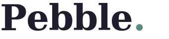

<div align="center">



# Pebble.

### *a calm place to start*

**An AI cognitive support companion that transforms overwhelming information into calm, structured, personalized clarity — built for neurodiverse users and anyone navigating cognitive overload.**

[](https://python.org)
[](https://fastapi.tiangolo.com)
[](https://react.dev)
[](https://azure.microsoft.com)
[](LICENSE)
[](https://pebble.redbay-c8c366b2.eastus.azurecontainerapps.io)

---

### [Live Demo](https://pebble.redbay-c8c366b2.eastus.azurecontainerapps.io) &nbsp;·&nbsp; [Video Walkthrough](#) &nbsp;·&nbsp; [Slide Deck](presentation/pebble_presentation.pptx) &nbsp;·&nbsp; [Architecture Diagrams](docs/diagrams/) &nbsp;·&nbsp; [Project Report](docs/reports/pebble_project_report.docx)

---

*Microsoft Innovation Challenge — SHPE 2026 &nbsp;|&nbsp; Challenge: **Cognitive Load Reduction** &nbsp;|&nbsp; March 16–27, 2026*

</div>

---

## Table of Contents

1. [The Problem](#the-problem)
2. [Who Pebble Is For](#who-pebble-is-for)
3. [Demo & Screenshots](#demo--screenshots)
4. [What Pebble Does](#what-pebble-does)
5. [Architecture](#architecture)
6. [Responsible AI](#responsible-ai)
7. [How the AI Works — The 12-Block Prompt](#how-the-ai-works--the-12-block-prompt)
8. [Azure Services — 8 Integrated](#azure-services--8-integrated)
9. [Tech Stack](#tech-stack)
10. [Project Structure](#project-structure)
11. [Getting Started](#getting-started)
12. [Environment Variables](#environment-variables)
13. [API Reference](#api-reference)
14. [Judging Criteria Alignment](#judging-criteria-alignment)
15. [Documentation](#documentation)
16. [Team](#team)
17. [License](#license)

---

## The Problem

**1 in 5 people** are neurodiverse. **77% of workers** report cognitive overload as a leading cause of burnout. Students, professionals, and everyday people are drowning in information that existing tools were not designed to handle.

Productivity apps were built for neurotypical workflows. They add structure by demanding more decisions. They put everything on screen at once. They measure your incomplete progress and remind you how far behind you are. They create anxiety in the name of organizing it.

The result: people freeze. They avoid the task. They spiral.

Pebble takes the opposite approach.

> Instead of asking *"what do you want to do?"* — Pebble asks *"what's on your mind?"* — and handles the rest.

---

## Who Pebble Is For

| Person | Situation | What overwhelms them |
|--------|-----------|----------------------|
| A college student with ADHD | Final exams + apartment search + job applications, all at once | Where to start. What matters. How to break it down. |
| A professional navigating a layoff | Benefits paperwork, job docs, interview prep, finances | Dense documents written to confuse, not inform. |
| Someone recently diagnosed with anxiety | Managing health appointments, insurance forms, daily routines | Too many steps. Too much to read. Too many decisions. |
| A first-generation college student | Graduation checklists, financial aid, career pivots | Systems that assume prior knowledge they don't have. |
| Anyone on a stressful day | An email, a task list, a goal that feels too big | The cognitive weight of starting. |

**Pebble handles the entire life** — not just work, not just school. Moving, studying, job searching, understanding legal documents, managing health, planning events. Anything that creates cognitive load.

---

## Demo & Screenshots

<div align="center">

### Video Walkthrough
**[Watch the Demo](#)** *(add link before submission)*

### Live Application
**[pebble.redbay-c8c366b2.eastus.azurecontainerapps.io](https://pebble.redbay-c8c366b2.eastus.azurecontainerapps.io)**

</div>

### App Walkthrough

| Onboarding | AI Chat |
|:-----------:|:-------:|
| *11-stage personalized onboarding — sets communication style, font, theme, reading level* | *SSE-streamed AI companion — context-aware responses with session history* |

| Task Decomposer | Focus Mode |
|:-----------:|:-------:|
| *Break any goal into time-boxed steps. Drag to reorder. Chat inline.* | *Full-screen, one task at a time. Breathing timer. Energy check-ins. Escape hatch.* |

| Document Processor | Settings |
|:-----------:|:-------:|
| *Upload any PDF or paste text. Pebble simplifies, explains, and opens a conversation.* | *Every preference live-adjustable. Four themes, four fonts, language, AI behavior.* |

> **To add screenshots:** drop images into `docs/` and update the table above with ``

---

## What Pebble Does

### Impact at a Glance

| Metric | Value |
|--------|-------|
| Azure services integrated | **8** |
| AI system prompt blocks assembled per request | **12** |
| Onboarding stages (zero-to-personalized) | **11** |
| Cognitive pressure categories detected | **7** |
| Time-of-day adaptive themes | **4** |
| User-selectable accessibility fonts | **4** |
| Languages supported | **3** (English, Spanish, Portuguese) |
| Demo document types included | **9** (budgets, leases, job docs, insurance, study guides...) |

### Five Pages — One Companion

| Page | What it does |
|------|-------------|
| **Home — AI Chat** | A persistent companion that knows your preferences, uploaded documents, and active tasks. Powered by a 12-block dynamic system prompt. Every response is personalized to your reading level, communication style, emotional state, and full life context. Responds via Server-Sent Events for real-time streaming. |
| **Documents** | Upload a PDF, Word doc, or paste any text. Pebble extracts it with Azure Document Intelligence, screens it through Content Safety, simplifies it to your reading level, and opens a conversation. Tap any sentence for a deeper explanation. Saved documents are searchable and persistent. |
| **Tasks** | Describe a goal — Pebble breaks it into time-boxed steps with gentle nudges. Drag to reorder. Decompose any task inline via a split-pane chat. Filter by available time. Delete or merge tasks via natural conversation. Synced to Cosmos DB across all pages. |
| **Focus Mode** | Full-screen, one task at a time. A circular breathing timer. Energy check-ins. An escape hatch that strips everything down to a single action when things feel too heavy. Session summaries on exit. |
| **Settings** | Every preference from onboarding live-adjustable with instant effect — communication style, reading level, font, theme, task granularity, language, and Pebble's identity color. |

### Additional Capabilities

- **11-stage personalized onboarding** — sets preferences that shape every AI response from the first message
- **4 adaptive time-of-day themes** — morning (peach), afternoon (warm coast), evening (dusk), night (deep ocean) — auto-detected by hour, manually overrideable
- **Pebble identity color** — users choose their personal color (sage, sky, lilac, amber) that cascades through the full UI
- **4 accessibility fonts** — DM Sans, Lexend, Atkinson Hyperlegible, OpenDyslexic — user-selectable from Settings
- **3 languages** — English, Spanish, Portuguese; the AI companion responds in the user's chosen language
- **Break Room** — a persistent breathing exercise overlay accessible from every page, for moments of overwhelm
- **Session archive** — every chat session is titled and archived; users can return to "what was I working on?"

---

## Architecture

### System Overview

```
User → React Frontend (Vite + Redux Toolkit + Framer Motion)
          ↕ /api/* — REST + Server-Sent Events (SSE)
       FastAPI Backend (Python 3.11)
          ├── [Block Assembly]  chat_service.py builds a 12-block system prompt per request
          ├── [Safety Layer]    content_safety.py screens input + output (2 tiers)
          ├── [AI Generation]   Azure OpenAI (GPT-4o) — streaming response
          ├── [Data Layer]      Azure Cosmos DB — preferences, tasks, chats, documents
          ├── [Documents]       Azure Document Intelligence → Azure Blob Storage
          ├── [Observability]   Azure Monitor + Application Insights
          └── [Secrets]         Azure Key Vault via DefaultAzureCredential
       Deployed: Azure Container Apps (via Azure Container Registry)
```

### Architecture Diagrams

All diagrams are in [`docs/diagrams/`](docs/diagrams/) and open in draw.io (diagrams.net).

| Diagram | What it shows |
|---------|--------------|
| [Pebble Architecture](docs/diagrams/Pebble%20Architecture.drawio) | Full system — frontend, backend, all Azure services |
| [12 Block Prompt](docs/diagrams/Pebble%2012%20Block%20Prompt.drawio) | How the dynamic system prompt is assembled per-request |
| [Content Safety Architecture](docs/diagrams/Pebble%20Content%20Safety%20Architecture%20Final.drawio) | Two-tier safety flow: input → GPT → output |
| [Document Pipeline](docs/diagrams/Pebble%20Doc%20Pipeline.drawio) | Upload → extraction → safety → simplification → Cosmos |
| [Deployment](docs/diagrams/Pebble%20Deployment%20Final.drawio) | Azure Container Apps infrastructure layout |

---

## Responsible AI

Responsible AI is not a feature in Pebble — it is the founding design constraint. Every architectural decision was made with neurodiverse safety as a first principle.

### Custom Cognitive Pressure Detection

Pebble implements a **7-category cognitive pressure detector** that runs before and after every AI call. Standard Azure Content Safety (Hate/Violence/Sexual/SelfHarm) was not designed for a cognitive wellness product — it misses the language patterns most harmful to anxious or neurodiverse users.

| Category | Example signal detected |
|----------|------------------------|
| **Urgency framing** | "You must submit this by Friday or you'll fail" |
| **Guilt triggers** | "You should have done this already" |
| **Catastrophizing** | "This is going to ruin everything" |
| **Perfectionism demands** | "It needs to be completely perfect before you submit" |
| **Shame language** | "You're so far behind everyone else" |
| **Social comparison** | "Most people your age have figured this out" |
| **Overwhelm stacking** | 7+ unstructured demands in a single message |

### Two-Tier Safety Response

| Severity | Source | Pebble's Response |
|----------|--------|-------------------|
| **5–6** | Azure Content Safety or cognitive pressure | Hard block — GPT-4o is never called. A pre-written calm response is returned. |
| **3–4** | Azure Content Safety or cognitive pressure | Soft flag — extra care instructions injected into Block 11 of the system prompt. GPT-4o responds with heightened sensitivity. |
| **1–2** | Any | Logged to Application Insights. No behavior change. |

### Context-Aware Document vs. Chat Screening

"You must submit by Friday" in an **uploaded syllabus** is factual context. The same phrase in a **user-typed message** is a stress signal. Pebble screens these inputs through different lenses — document content is analyzed for embedded pressure language separately from conversational input.

### Content Safety on AI Output

After the SSE stream completes, the full AI response is re-screened. If the output triggers thresholds, a `replace` event is sent to the frontend — the message is swapped silently without the user seeing an error.

### Design-Level Safety Principles

- **No anxiety-inducing progress metrics** — no streaks, points, leaderboards, or "X tasks remaining" countdowns
- **Every error sounds like Pebble talking** — no HTTP codes, no alarming language: *"something went quiet. let's try that again."*
- **One question per response, maximum** — never overwhelming the user with multiple decisions at once
- **The escape hatch is always visible** — in Focus Mode, "i need a pause" is never hidden
- **No locked states** — every preference is live-adjustable; every mode has an immediate exit

---

## How the AI Works — The 12-Block Prompt

Every `/api/chat` request assembles a fresh system prompt from 12 dynamic blocks — built in `chat_service.py` for each call. No static prompts. No generic responses.

| Block | Name | What goes in it |
|-------|------|----------------|
| 1 | **Identity** | Pebble's core identity, 7 nevers, 6 always behaviors, voice rules |
| 2 | **User Profile** | Name, communication style, granularity preference, reading level |
| 3 | **Long-Term Memory** | What Pebble has learned about this user from past Cosmos interactions |
| 4 | **Learned Patterns** | Behavioral patterns detected over time (e.g., prefers shorter tasks in evenings) |
| 5 | **Time Context** | Time of day, day of week — shapes greeting tone and energy level |
| 6 | **Emotional Signals** | Cognitive load signals detected in the current message |
| 7 | **Conversation History** | Last 20 turns (from Cosmos DB) |
| 8 | **Document Context** | Summaries of the user's uploaded documents (up to 800 chars each) |
| 9 | **Task Context** | Current task groups and active tasks |
| 10 | **Page Context** | Which page the user is on — shapes what Pebble can and can't do |
| 11 | **Safety Instructions** | Dynamically adjusted by content safety tier (none / soft / heightened) |
| 12 | **Response Format** | Voice rules, `###ACTIONS[...]###` instruction for UI navigation |

The `###ACTIONS` marker is appended by GPT-4o in its response, stripped by `chat_service.py` via regex, and emitted as a separate SSE `actions` event. The frontend never sees raw markers. Actions include: `navigate_to`, `create_tasks`, `merge_tasks`, `delete_tasks`, `open_focus`.

Full spec: [`docs/specs/PEBBLE_PERSONALITY.md`](docs/specs/PEBBLE_PERSONALITY.md)

---

## Azure Services — 8 Integrated

| # | Service | How Pebble uses it |
|---|---------|-------------------|
| 1 | **Azure OpenAI (GPT-4o)** | All AI generation — chat (SSE streaming), task decomposition, document simplification, nudges, session title generation. The 12-block prompt is assembled fresh per request. |
| 2 | **Azure Cosmos DB** | Serverless NoSQL. Stores user preferences, task groups, full chat history, document metadata, focus sessions, user memories, and learned behavioral patterns — all partitioned by `/user_id`. |
| 3 | **Azure AI Content Safety** | Input screening before every GPT call. Output screening after every stream. Two-tier severity system (hard block / soft flag). Combined with Pebble's custom cognitive pressure regex. |
| 4 | **Azure AI Document Intelligence** | Extracts text from PDF and Word uploads using the `prebuilt-read` model. Magic-byte file validation before upload. Feeds the document simplification and Q&A pipeline. |
| 5 | **Azure Blob Storage** | Archives every uploaded document under user-scoped paths (`{user_id}/{uuid}/{filename}`) for retrieval and audit. |
| 6 | **Azure Container Apps** | Production deployment. Single Docker image — FastAPI backend serves the React static build from one URL. Deployed via Azure Container Registry (`az acr build`). |
| 7 | **Azure Monitor / Application Insights** | Full OpenTelemetry auto-instrumentation. Custom events: `task_decomposed`, `document_uploaded`, `session_created`, `content_safety_flagged`, `safety_hard_block`, `cognitive_pressure_detected`. |
| 8 | **Azure Key Vault** | All secrets fetched at startup via `DefaultAzureCredential` — Managed Identity in production, `az login` locally. Zero secrets in environment variables in production. |

---

## Tech Stack

| Layer | Technology |
|-------|-----------|
| **Backend** | Python 3.11, FastAPI, Pydantic v2, Uvicorn / Gunicorn |
| **Frontend** | React 18, React Router v7, Redux Toolkit, Framer Motion, Vite |
| **AI** | Azure OpenAI SDK, custom 12-block prompt assembly, SSE streaming |
| **Azure SDK** | `azure-cosmos`, `azure-ai-formrecognizer`, `azure-storage-blob`, `azure-ai-contentsafety`, `azure-monitor-opentelemetry`, `azure-keyvault-secrets` |
| **Drag & Drop** | `@dnd-kit/core`, `@dnd-kit/sortable` |
| **Accessibility Fonts** | DM Serif Display, DM Sans, Lexend, Atkinson Hyperlegible, OpenDyslexic |
| **Infrastructure** | Docker, Azure Container Apps, Azure Container Registry, Bicep (IaC) |
| **Streaming Protocol** | Server-Sent Events (SSE) — token-level streaming for all AI responses |

---

## Project Structure

```
Pebble./
│
├── README.md                       # This file
├── CLAUDE.md                       # Full developer handoff document
├── Dockerfile                      # Docker build — single image, API + static frontend
├── build.sh                        # Builds React app → backend/static/
├── startup.sh                      # Starts Gunicorn in production
├── LICENSE
│
├── backend/                        # Python / FastAPI
│   ├── main.py                     # All 15 route handlers
│   ├── chat_service.py             # 12-block prompt assembly + SSE streaming + action parsing
│   ├── ai_service.py               # Azure OpenAI wrapper (decompose, summarise, nudge, explain)
│   ├── content_safety.py           # Azure Content Safety + 7-category cognitive pressure regex
│   ├── db.py                       # Cosmos DB async repository (7 collections)
│   ├── doc_intelligence.py         # Azure Document Intelligence extraction
│   ├── blob_service.py             # Azure Blob Storage upload
│   ├── monitoring.py               # Application Insights — OpenTelemetry + custom events
│   ├── keyvault.py                 # Azure Key Vault — DefaultAzureCredential
│   ├── models.py                   # Pydantic v2 request/response schemas
│   ├── config.py                   # Environment + Key Vault config
│   └── requirements.txt
│
├── frontend/                       # React / Vite
│   ├── index.html                  # Entry — loads DM Serif Display, all accessibility fonts
│   ├── vite.config.js              # Dev server proxies /api → localhost:8000
│   └── src/
│       ├── App.jsx                 # Routes, time-of-day theme, onboarding gate, loading gate
│       ├── store.js                # Redux: prefsSlice, tasksSlice, summariseSlice
│       ├── pages/
│       │   ├── Home.jsx            # AI chat — SSE streaming, hero mode, session archive
│       │   ├── Onboarding.jsx      # 11-stage state machine
│       │   ├── DocumentsHub.jsx    # Document library + upload
│       │   ├── DocumentSession.jsx # Per-document conversation + sentence-level Q&A
│       │   ├── Tasks.jsx           # Living task list — drag, decompose, inline chat
│       │   ├── FocusMode.jsx       # 6-state full-screen focus timer
│       │   └── Settings.jsx        # All preferences, live preview
│       ├── components/
│       │   ├── TopNav.jsx          # Brand nav, identity color picker, user avatar
│       │   ├── WalkthroughOverlay.jsx  # 5-step guided spotlight tour
│       │   ├── BreakRoomButton.jsx # Persistent breathing break access
│       │   ├── BreakRoomOverlay.jsx    # Full-screen breathing overlay
│       │   ├── TimerRing.jsx       # SVG circular timer ring
│       │   └── FocusTimer.jsx      # Focus Mode timer logic
│       ├── utils/
│       │   ├── api.js              # All API helpers + chatStream SSE parser
│       │   └── bionic.jsx          # Bionic Reading word-bolding utility
│       └── styles/global.css       # All CSS — 4 themes, design tokens, animations
│
├── infra/
│   └── neurofocus.bicep            # Azure Infrastructure-as-Code
│
├── docs/
│   ├── specs/                      # Feature & personality specifications
│   ├── session-history/            # 18-session build log (March 16–27, 2026)
│   ├── diagrams/                   # Architecture diagrams (.drawio — open in diagrams.net)
│   ├── reports/                    # Project reports and technical breakdown
│   ├── branding/                   # Logo assets (SVG, PNG)
│   └── archive/                    # Early-phase documentation
│
├── demo/                           # 9 sample documents for demo walkthrough
│   ├── Monthly_Budget_March_2026.pdf
│   ├── Health Insurance Comparison 2026.pdf
│   ├── Lease Agreement Park Ave Apt.pdf
│   ├── Cloud Solutions Architect Job Doc.pdf
│   ├── UCF Graduation Checklist Spring 2026.pdf
│   └── ... 4 more
│
├── presentation/
│   └── pebble_presentation.pptx    # Judge slide deck
│
└── audit/                          # UX audit reports + trial screenshots
```

---

## Getting Started

### Prerequisites

- Python 3.11+
- Node.js 20+
- Azure account with services provisioned

### 1. Clone & Configure

```bash
git clone <repo-url>
cd Cognitive-Load---SHPE-2026-Hackathon
cp backend/.env.example backend/.env
# Fill in AZURE_OPENAI_* and COSMOS_* at minimum
```

### 2. Backend

```bash
cd backend
python -m venv venv && source venv/bin/activate
pip install -r requirements.txt
uvicorn main:app --reload
# API running at http://localhost:8000
# Swagger UI at http://localhost:8000/docs
```

### 3. Frontend

```bash
cd frontend
npm install
npm run dev
# App running at http://localhost:5173
# All /api/* requests proxy to localhost:8000
```

### 4. Production Build — Single URL

```bash
./build.sh      # Builds React → copies dist/ into backend/static/
./startup.sh    # Starts Gunicorn — serves API + frontend from one port
```

### 5. Docker

```bash
docker build -t pebble .
docker run -p 8000:8000 --env-file backend/.env pebble
```

---

## Environment Variables

Copy `backend/.env.example` → `backend/.env`. Minimum required to run locally: `AZURE_OPENAI_*` and `COSMOS_*`. All other Azure services degrade gracefully if not configured.

| Variable | Required | Description |
|----------|----------|-------------|
| `AZURE_OPENAI_ENDPOINT` | Yes | Azure OpenAI resource endpoint |
| `AZURE_OPENAI_API_KEY` | Yes | Azure OpenAI API key |
| `AZURE_OPENAI_DEPLOYMENT` | No | Deployment name (default: `gpt-4o`) |
| `AZURE_OPENAI_API_VERSION` | No | API version (default: `2024-02-01`) |
| `COSMOS_ENDPOINT` | Yes | Cosmos DB account endpoint |
| `COSMOS_KEY` | Yes | Cosmos DB primary key |
| `COSMOS_DATABASE` | No | Database name (default: `neurofocus`) |
| `CONTENT_SAFETY_ENDPOINT` | No | Azure Content Safety endpoint |
| `CONTENT_SAFETY_KEY` | No | Azure Content Safety key |
| `BLOB_CONNECTION_STRING` | No | Azure Blob Storage connection string |
| `DOC_INTELLIGENCE_ENDPOINT` | No | Azure Document Intelligence endpoint |
| `DOC_INTELLIGENCE_KEY` | No | Azure Document Intelligence key |
| `APP_INSIGHTS_CONNECTION_STRING` | No | Application Insights connection string |
| `KEYVAULT_URL` | No | Key Vault URL — enables Managed Identity secret fetch at startup |
| `ALLOWED_ORIGINS` | No | Comma-separated CORS origins (default: `http://localhost:5173`) |
| `PORT` | No | Server port — set automatically by Azure Container Apps |

**In production:** set `KEYVAULT_URL` and grant the Container App's Managed Identity the `Key Vault Secrets User` role — all other secrets are fetched automatically.

---

## API Reference

| Method | Path | Description |
|--------|------|-------------|
| `GET` | `/health` | Health check |
| `GET` | `/api/preferences` | Load user preferences from Cosmos |
| `PUT` | `/api/preferences` | Save user preferences to Cosmos |
| `POST` | `/api/chat` | AI companion chat — 12-block prompt, SSE streaming, action parsing |
| `POST` | `/api/decompose` | Break a goal into structured task groups (GPT-4o) |
| `POST` | `/api/summarise` | Simplify text to reading level (SSE stream) |
| `POST` | `/api/explain` | Explain a single sentence |
| `POST` | `/api/nudge` | Generate a supportive task nudge |
| `POST` | `/api/upload` | Upload document — Doc Intelligence + Blob Storage + Cosmos metadata |
| `GET` | `/api/tasks` | Load task groups from Cosmos |
| `POST` | `/api/tasks` | Save task groups to Cosmos |
| `GET` | `/api/conversations` | Load full chat history from Cosmos |
| `GET` | `/api/documents` | List user's uploaded documents from Cosmos |
| `GET` | `/api/sessions` | List focus sessions |
| `POST` | `/api/sessions` | Save a completed focus session |

Full Swagger UI available at `/docs` when the backend is running.

---

## Judging Criteria Alignment

| Criterion (25% each) | How Pebble addresses it |
|----------------------|------------------------|
| **Performance** | Token-level SSE streaming — users see the first word in milliseconds, not after a full response completes. Serverless Cosmos DB auto-scales with zero provisioning. React with Redux Toolkit minimizes re-renders. Single Docker image, single port deployment. |
| **Innovation** | A 12-block dynamic system prompt assembled fresh per request — no static prompts, full personalization. A custom 7-category cognitive pressure detector built specifically for neurodiverse safety, extending beyond Azure Content Safety's standard categories. Neurodiverse-first design philosophy: four accessibility fonts, bionic reading, time-of-day themes, identity color picker, one-question-per-response rule enforced at the prompt level. |
| **Breadth of Azure Services** | 8 Azure services fully integrated and production-deployed: OpenAI (GPT-4o), Cosmos DB (NoSQL serverless), Content Safety, Document Intelligence, Blob Storage, Container Apps, Monitor / Application Insights, Key Vault. Each service is load-bearing — none are "integrated" in name only. |
| **Responsible AI** | Two-tier content safety system (hard block + soft flag). Custom 7-category cognitive pressure regex detecting patterns standard APIs miss. Context-aware screening (document vs. conversational input). AI output re-screened after streaming completes. No anxiety-inducing UX patterns by design (no streaks, no countdowns, no shame metrics). Every error message written in Pebble's calm voice. |

---

## Documentation

| Document | Description |
|----------|-------------|
| [`CLAUDE.md`](CLAUDE.md) | Full developer handoff — build status, architecture decisions, all known issues |
| [`docs/specs/PEBBLE_PERSONALITY.md`](docs/specs/PEBBLE_PERSONALITY.md) | Complete AI personality spec — 5 layers, 12 blocks, voice guide, content safety |
| [`docs/specs/TASKS_SPEC.md`](docs/specs/TASKS_SPEC.md) | Tasks page — full interaction spec |
| [`docs/specs/SESSION4_FINAL.md`](docs/specs/SESSION4_FINAL.md) | Focus Mode — 6-state machine spec |
| [`docs/specs/color_system.md`](docs/specs/color_system.md) | Full color system across all 4 time-of-day themes |
| [`docs/specs/PEBBLE_BRAND.md`](docs/specs/PEBBLE_BRAND.md) | Brand identity — name origin, logo rationale, typography |
| [`docs/reports/pebble_project_report.docx`](docs/reports/pebble_project_report.docx) | Full project report |
| [`docs/reports/pebble_project_breakdown_v2.docx`](docs/reports/pebble_project_breakdown_v2.docx) | Technical breakdown |
| [`docs/diagrams/`](docs/diagrams/) | All architecture diagrams (.drawio) |
| [`presentation/pebble_presentation.pptx`](presentation/pebble_presentation.pptx) | Judge slide deck |

---

## Team

| Member | Role |
|--------|------|
| **Diego Figueroa** | Lead — architecture, all Azure integrations, AI systems, full-stack, UI/UX · *Microsoft Certified: Azure Administrator Associate (AZ-104)* |
| **Andy Jaramillo** | Project support |
| **Gabe** | Prompt engineering |
| **David** | Documents page |

---

## License

This project is licensed under the [MIT License](LICENSE).

---

<div align="center">

**Microsoft Innovation Challenge — SHPE 2026**

Performance &nbsp;·&nbsp; Innovation &nbsp;·&nbsp; Breadth of Azure Services &nbsp;·&nbsp; Responsible AI

---

*"We named it Pebble because that's what it does. It takes something overwhelming — a 12-page document, a massive to-do list, a task you've been avoiding — and turns it into something small enough to hold. Something you can actually do. A pebble."*

</div>
